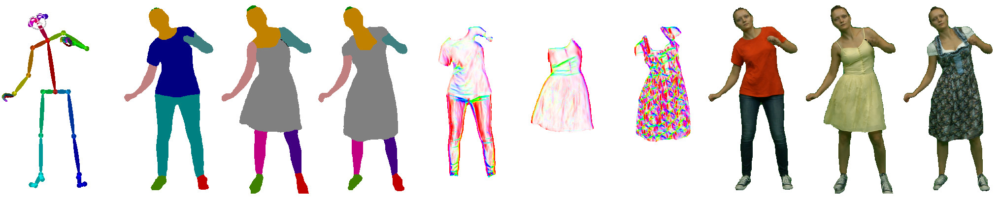

# High-Fidelity Neural Human Motion Transfer from Monocular Video

&nbsp;&nbsp;[](https://opensource.org/licenses/MIT)



### [Website](https://graphics.tu-bs.de/publications/kappel2020high-fidelity) | [Collaborators](http://gvv.mpi-inf.mpg.de/projects/NHMT/) | [ArXiv](https://arxiv.org/abs/2012.10974) | [Video](https://www.youtube.com/watch?v=14VaWFVeKy4&t=1s) <br>


Official PyTorch implementation of our HF-NHMT method described in our paper 'High-Fidelity Neural Human Motion Transfer from Monocular Video'.


## Prerequisites
- Linux or macOS
- Python 3

## Dataset
You can download our training and test sequences from [here](https://nextcloud.mpi-klsb.mpg.de/index.php/s/jb42tJr4oiZQXzS).

## Getting Started
### Installation
- Clone this repository using:
```
git clone https://github.com/MoritzKappel/HF-NHMT.git && cd HF-NHMT
```

-  This project is implemented in Python 3 using the PyTorch framwork and several other python packages. For your convenience, a preconfigured conda environment is provided at *configs/conda.yml*.
To create and activate the environment, run:
```
conda env create -f configs/conda.yml && conda activate HF-NHMT
```

- If you want to use our data preprocessing script to train on custom datasets, you need to checkout the [OpenPose](https://github.com/CMU-Perceptual-Computing-Lab/openpose) and [Self-Correction-Human-Parsing](https://github.com/PeikeLi/Self-Correction-Human-Parsing) repositories in the *thirdparty* directory:
```
git submodule init && git submodule update
```
To extract pose keypoints, you will need to install the openpose demo by following the official [instructions](https://github.com/CMU-Perceptual-Computing-Lab/openpose/blob/master/doc/installation/0_index.md).
For body part segmentations, we use an out-of-the-box model of Li et al. pretrained on the ATR dataset. Just download the weights from [here](https://drive.google.com/file/d/1ruJg4lqR_jgQPj-9K0PP-L2vJERYOxLP/view?usp=sharing) and deposit them in *thirdparty/Self-Correction-Human-Parsing*.

### Data Preprocessing
Our method operates on monocular video footage, using pose keypoint as inputs and the original video frames as training label. Additionally, we employ dense body part segmentations and a gabor-filter-based structure representation as intermediate training annotations.
After training, new source motions can be transfered to the actor using only our skeleton representation, which can additionally be normalized to fit the training data distribution as described in [this paper](https://carolineec.github.io/everybody_dance_now/) of Chan et al.

To train on a custom dataset, you need to provide a directory containing a static background image of the scene called *background.png*, and a subdirectory called *images/* comprising the video frames in natural ordering (we use a resolution of 512x512 pixels).
Then run
```
./scripts/generate_dataset.py -i <path_to_dataset_directory> --train
```
to automatically generate all the required training inputs and labels. Several parameters and paths to third-party code can be adjusted directly in the script file.

If you want to generate only  pose skeleton inputs from a source motion sequence, use:
```
./scripts/generate_dataset.py -i <source_actor_dataset_path> --pose_norm <target_actor_dataset_path> 
```
Here, statistics from the target actor dataset will be extracted to perform pose and motion normalization. Alternatively, unnormalized pose skeletons (generated for training) can be used for comparable source and target actor sequences.


### Training
To train a new model, you need a dataset and configuration file, which is automatically created in the *configs* directory when calling the data preprocessing script.
A list of all configuration options can be found [here](resources/CONFIG.md).
After customizing the *dataset* and *training* parameters in the configuration file, run
```
./scripts/train.py -c <config_file_path>
```
to start the training.


### Inference
To transfer new motion sequences to the target actor, adjust the *dataset* and *inference* parameters in the configuration file, before running:
```
./scripts/run.py -c <config_file_path>
```
Note that during inference, the dataset path refers to the source actor sequence containing the new pose skeletons instead of the dataset used to train the target actor networks.

## Citation
If you use our code for your publications, please cite our [paper](https://graphics.tu-bs.de/upload/publications/kappel2020NHMT/Kappel_NHMT.pdf) using the following BibTeX:

```
@article{kappel2020high,
  title={High-Fidelity Neural Human Motion Transfer from Monocular Video},
  author={Kappel, Moritz and Golyanik, Vladislav and Elgharib, Mohamed and Henningson, Jann-Ole and Seidel, Hans-Peter and Castillo, Susana and Theobalt, Christian and Magnor, Marcus},
  journal={arXiv preprint arXiv:2012.10974},
  year={2020}
}
```

## Acknowledgments
This work was partially funded by the DFG (MA2555/15-1 ``Immersive Digital Reality'') and the ERC Consolidator Grant 4DRepLy (770784).

